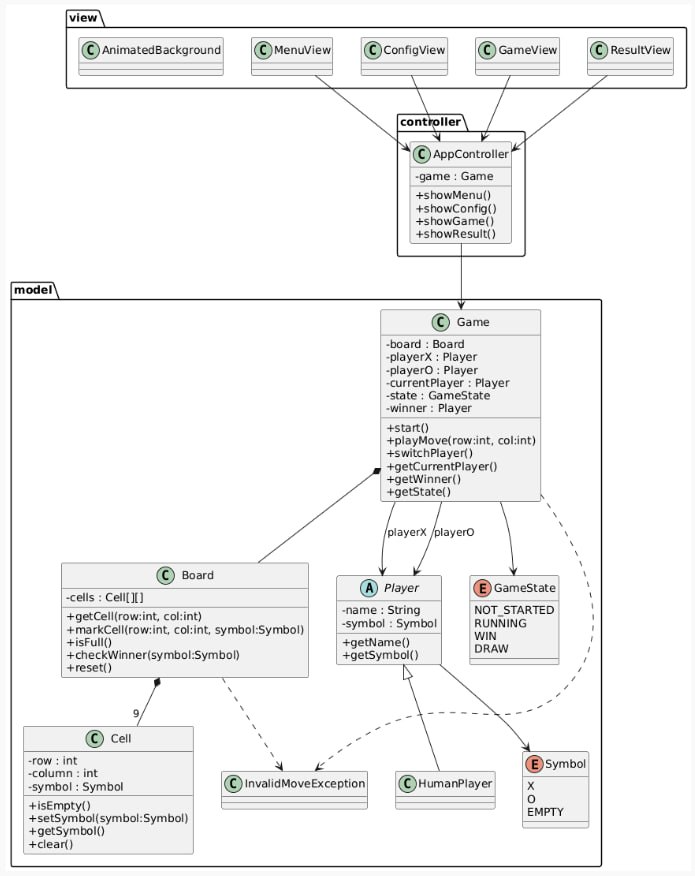
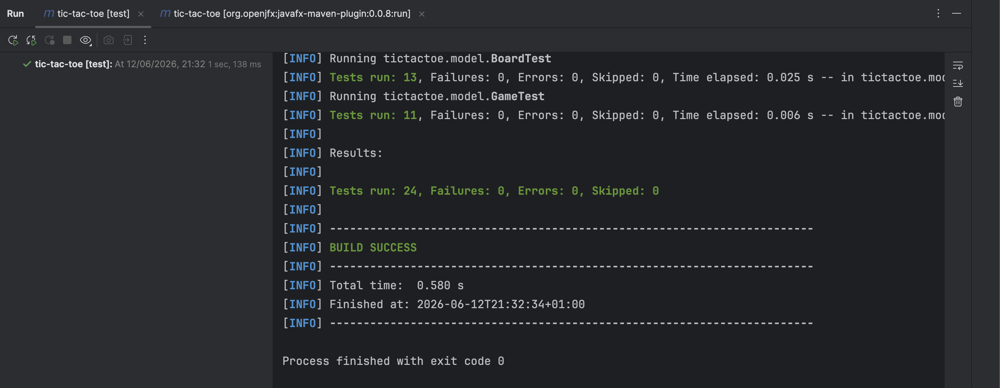

# Jogo Tic Tac Toe

Projeto desenvolvido no âmbito da unidade curricular de Programação Orientada a Objetos.

## Descrição

Esta aplicação consiste num jogo Tic Tac Toe desenvolvido em Java, com interface gráfica em JavaFX.

O jogo permite que dois jogadores humanos joguem entre si num tabuleiro 3x3. O jogador X inicia a partida e os jogadores alternam turnos até existir um vencedor ou até o jogo terminar em empate.

## Funcionalidades

* Menu principal da aplicação
* Configuração dos nomes dos jogadores
* Tabuleiro interativo 3x3
* Validação de jogadas inválidas
* Deteção de vitória por linha, coluna ou diagonal
* Deteção de empate
* Ecrã de resultado final
* Possibilidade de iniciar uma nova partida
* Testes unitários ao modelo do domínio

## Tecnologias utilizadas

* Java
* JavaFX
* Maven
* JUnit 5

## Estrutura do projeto

```text
src/main/java        Código fonte da aplicação
src/main/resources   Recursos utilizados pela aplicação
src/test/java        Testes unitários
docs                 Documentação adicional e capturas de ecrã
```

## Documentação

O enunciado da primeira fase do projeto pode ser consultado no seguinte ficheiro:

[Enunciado da Fase 1](docs/fase1.pdf)

## Diagrama UML



## Interface da Aplicação

### Menu Inicial


### Configuração dos Jogadores


### Ecrã do Jogo


### Ecrã de Resultado


## Como executar

Para executar a aplicação, é necessário ter Java instalado e o projeto corretamente configurado com Maven.

A aplicação pode ser executada através do IntelliJ IDEA, correndo a classe `Launcher`, localizada no package `tictactoe`:

```text
tictactoe.Launcher
```

A classe `Launcher` é responsável por iniciar a aplicação, chamando a classe principal `Main`, onde é criada a interface gráfica em JavaFX.

Também é possível executar a aplicação através do Maven, caso o projeto esteja corretamente configurado no ficheiro `pom.xml`:

```bash
mvn javafx:run
```

## Testes

Os testes unitários foram desenvolvidos com JUnit 5 e encontram-se em:

```text
src/test/java
```

Os testes podem ser executados através do IntelliJ IDEA, utilizando a janela Maven:

```text
Maven > Lifecycle > test
```

Também podem ser executados através do terminal, caso o Maven esteja instalado no sistema:

```bash
mvn test
```

Na execução realizada, foram executados 24 testes unitários, todos concluídos com sucesso, sem falhas nem erros.

### Resultado da execução dos testes



## Autores

* Artem Chernousov — 202300991
* Josebe Paulo Silva — 2025100504
